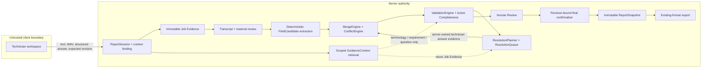

# Unified Field Service Documentation Agent — final P0 engineering report

Date: 2026-09-27

Branch: `feat/unified-report-session`
Decision: **MERGE_READY** (no merge to `main` performed)

## 1. Executive result

The supported technician workflow now has one reachable authority path:

`Capture → Evidence → Transcript review → FieldCandidate[] → Guidance retrieval → Merge/Conflict → Validation → ResolutionQueue → Review → Confirmation → immutable ReportSnapshot → existing-format export`

The server owns the ReportSession, revision, evidence/provenance, field semantics, validation, queue, review and confirmation gates, final snapshot, and export source. The browser renders server state and sends commands with an expected revision. Legacy client-draft confirmation/save/export endpoints return `410 LEGACY_AUTHORITY_DISABLED`, and the obsolete browser-authority bundle is no longer served.

## 2. Final architecture and trust boundaries

`Evidence` and `GuidanceContext` are different contracts and stores. A ReportField can select only eligible candidates with Job Evidence references. Guidance can normalize terminology, explain a requirement, identify modules, or trigger a question; it cannot establish performed work, parts used, measurements, tests, completion, return-to-service, or safety.

Persistence is file-backed and content/hash checked. Session mutations are revision-gated; immutable records use collision checks; capture and resolution retries have source/request-bound idempotency. This P0 store serializes within one process. Multi-process transactional persistence is P1.

## 3. Technician workflow

1. The technician selects a published supported report; server template/version, context corpus, renderer, and available work-order context are bound before capture.
2. Text or audio is persisted as evidence. Audio bytes are stored before Whisper runs.
3. Harmless normalization proceeds; only material transcript corrections interrupt the workflow.
4. Server extraction creates evidence-bound FieldCandidates. Merge, conflict, validation, and completeness run deterministically.
5. The UI projects every server-owned ResolutionItem into the generated schema-ordered report at the affected field. Structured inline answers remain safety-prioritized by the server, while one global voice/text action can supply multiple missing facts without forcing a sequential wizard.
6. With no blocking queue, the server enters REVIEW. Review acknowledgement creates READY plus a validation receipt for the exact revision and structured-state hash.
7. One visible `Submit report` action requests review completion and then confirmation for the returned exact revision. The server performs both gates, reloads authoritative state, binds the server principal, and creates one immutable snapshot; the browser does not supply a final draft.
8. Export renders from the snapshot. Export failure cannot invalidate or duplicate confirmation, and retry is idempotent.

## 4. ReportSession lifecycle and final gates

`CONTEXT → CAPTURE → PROCESSING → CORRECTION_IF_NEEDED? → RESOLVE → REVIEW → READY → CONFIRMED`

`RECOVERABLE_ERROR` retains the failed phase and saved evidence. REVIEW requires current processing, no blocking queue, no required UNKNOWN, blocking UNCERTAIN/CONFLICT/INVALID, unresolved safety confirmation, or unresolved conditional requirement. READY additionally requires the explicit review-complete event and a current validation receipt. Confirmation verifies session/revision, template/version, Agent run, structured-state hash, receipt status, and review event before snapshot creation.

The snapshot retains template/version, semantic states, structured fields, evidence references, validation and confirmation references, server principal, session/revision, timestamp, report hash, and snapshot hash. Confirmed sessions reject ordinary capture mutation. Amendments require a future new-revision workflow; historical output is not mutated.

## 5. Engines

- MergeEngine groups candidates by canonical claim and preserves all provenance. Source priority can permit automatic acceptance but cannot erase a contradictory reliable value.
- ConflictEngine produces `CONFLICT` when reliable claims differ. Technician resolution links the chosen/new candidate, all resolved candidates, issue IDs, principal, timestamp, and revision.
- ValidationEngine applies required/conditional fields, type, enum, unit/range, identity, negation, planned-work, evidence eligibility, critical confirmation, safety/completion, Guidance grounding, and template-version rules. Blocking values are excluded from official facts/output.
- ResolutionPlanner deduplicates by field/issues and orders `SAFETY > CONFLICT > REQUIRED MISSING > REQUIRED UNCERTAIN > RULE VIOLATION > OPTIONAL`. Optional missing data does not block.

The eight field states remain distinct: `KNOWN_VALUE`, `EXPLICIT_NONE`, `NOT_APPLICABLE`, `UNKNOWN`, `UNCERTAIN`, `CONFLICT`, `INVALID`, and `INFERRED`. FieldState and SupportType remain independent.

## 6. Final authoritative API surface

All mutation endpoints require bearer authorization, derive session identity from the route, reject client authority fields, and require `expected_revision` unless noted.

| Method/path | Owner and purpose | Accepted untrusted input | Idempotency / major states |
| --- | --- | --- | --- |
| `POST /api/report-sessions` | Create server-bound session/context | template id/version, optional job-context reference | New `CONTEXT`; server creates IDs/bindings |
| `GET /api/report-sessions/:id` | Load authoritative chain | route ID | Read-only; supports reload/restart |
| `GET /api/report-sessions/:id/agent-state` | Current fields/issues/queue | route ID | Deterministically rebuilds if needed |
| `POST .../capture/text` | Persist text evidence and process | text, language, expected revision, idempotency key | Source-bound; correction, resolve, or recovery |
| `POST .../capture/audio` | Persist WAV before real STT and process | WAV bytes plus model/language headers, expected revision, idempotency key | Content/source-bound; retry-safe |
| `POST .../transcription/retry` | Retry saved audio evidence | evidence ID, expected revision | Same evidence/session only; no duplicate evidence |
| `POST .../transcript-reviews/:review/decide` | Record every material correction decision | complete ACCEPT/REJECT/NO_CHANGE set, expected revision | Review/session bound; raw transcript retained |
| `POST .../resolution-items/:item/answer` | Resolve current issue(s) | structured answer, expected revision, idempotency key | Request-bound replay; stale writes rejected |
| `POST .../fields/:field/answer` | Read-first edit/manual answer | value/unit, expected revision | Server creates manual evidence |
| `POST .../fields/:field/select` | Select report draft, exact transcript words, prior edit, semantic state, or new manual value | selection kind plus server-owned candidate/span reference or manual value, expected revision, idempotency key | Server verifies same-session provenance, creates confirmation evidence/event, retains alternatives, and re-merges |
| `POST .../candidates/:candidate/confirm` | Confirm eligible candidate | expected revision | Server creates confirmation support/event |
| `POST .../attachments` | Preserve classified supporting evidence | bytes, filename, purpose, expected revision | Non-authoritative until a supported extractor exists |
| `POST .../guidance/uploads` | Ingest session-scoped knowledge | bytes/filename, expected revision | Scope and uploader derived by server |
| `GET .../guidance` | Minimal on-demand explanation | route ID | No scores/chunk/debug metadata in technician response |
| `POST .../review` | Enter human review | expected revision | Requires complete current Agent state |
| `POST .../review/complete` | Acknowledge review and create validation receipt | expected revision | Creates READY receipt bound to exact state |
| `POST .../confirm` | Create server confirmation and immutable snapshot | expected revision only | Replay returns same snapshot; stale/forged input rejected |
| `POST .../export` | Render snapshot in supported existing format | expected revision only | Snapshot-owned, retry-idempotent; failure preserves confirmation |

Deprecated finalization endpoints returning 410: `/api/report-sessions/:id/confirmation`, `/api/reports/{confirm,save,export}`, and `/api/v2/reports/{confirm,save,export}`. Diagnostic extraction/build routes remain compatibility adapters and cannot finalize ReportSession state.

## 7. Domain and RAG architecture

The unified workflow delegates domain vocabulary/extraction/template policy to HVAC, SBS Bus, SBS Rail, Oilfield, and Power Grid adapters. They do not own final lifecycle transitions. Scoped lexical retrieval uses the versioned registry, allowed corpora, session-bound uploads, provenance-bearing chunks, and server-selected query/scope. Cross-domain results and upload contamination fail closed. Embeddings, semantic search, OCR, diagnosis, prediction, and generative report prose remain out of P0.

## 8. Migration and deprecation

| Old component/path | Unified replacement | Status | Parity evidence | Safe to remove? | Notes |
| --- | --- | --- | --- | --- | --- |
| Browser-owned ReportSession / FieldState | server ReportSession + Agent state | REPLACED | workspace lifecycle, reload, stale-write tests | Active path removed | `web/report-runtime.js` is compatibility/test-only |
| `web/app.js` authority orchestration | `web/template-app.js` server projection | TEST-ONLY | live browser journey and static 404 test | Yes after legacy tests migrate | Not served or loaded |
| Browser `knowledge_hits` | server GuidanceContext retrieval | REPLACED | RAG isolation/adversarial suites | Yes | Guidance never evidence |
| `/api/template-reports/build` final authority | snapshot-native finalization | ADAPTER | final HTTP and export parity | Keep diagnostic for now | Cannot confirm/save/export |
| V2 facts/report builder final path | Agent candidates + snapshot output | DEPRECATED | Bus/Rail legacy-build tests | Remove after diagnostic consumers migrate | Final endpoints return 410 |
| HVAC V1 confirm/save/export | ReportSession confirm/export | DEPRECATED | legacy-route 410 plus unified lifecycle | Remove after legacy tests migrate | No parallel HVAC final workflow |
| split audio/transcription orchestration from `223b7af` | authoritative capture service | REPLACED | audio-before-STT, retry/idempotency, real ASR | Historical files already removed | Useful capability accounted for |
| old guided-report browser orchestration | server retrieval + ResolutionPlanner | REPLACED | Guidance/RAG tests and UI “Why required?” | Yes | No permanent RAG panel |
| old confirmation token/draft | revision/hash/receipt-bound snapshot | REPLACED | final authority/adversarial tests | Yes | Client final draft ignored/rejected |
| old export writers | snapshot-owned official export | REPLACED | failure/retry/restart tests | Old tools remain test compatibility | New output owns P0 |

Both `origin/feature/rag-guided-reporting@c2c2df2` and historical `223b7af` are ancestors/accounted for. Scope registry, isolation, uploads, deterministic extraction, terminology/negation/planned-work/measurement/safety safeguards, lexical retrieval, and guided questions are migrated as modules; old authority assumptions are not.

## 9. Frozen P0 and adversarial verification

`evaluation/p0-report-session-acceptance.v1.json` freezes all 15 required scenarios: mostly complete SBS Bus, multi-field statement, explicit none, identity conflict, uncertain measurement, unknown root cause, planned work, negation, RAG guidance, safety, STT failure, upload failure, stale concurrent answer, stale confirmation, and successful confirmation/export. The contract test requires expected/forbidden behavior and automated evidence for every case.

The 30 requested trust attacks map to automated suites covering forged support/provenance/evidence/span/candidate/field/draft/validated/resolved claims; value-number-unit-identity/negation/planned mutations; Guidance/RAG promotion; cross-session evidence/transcript/receipt reuse; stale/replayed answers and confirmation; source-bound audio idempotency; cross-domain contamination; and direct endpoint bypass. The finalization suite additionally injects another session's validation receipt and verifies READY remains unchanged with no confirmation/snapshot.

Active completeness and minimal-question checks show zero duplicate questions, no question for authoritative known identity, no safely derivable question, safety-first ordering, disappearance after resolution, and one-answer/multi-issue support. The live SBS journey asked only unresolved/safety/conflict items and never asked the technician to search the report.

## 10. Verification results

| Verification | Result |
| --- | --- |
| Full syntax plus repository suite (`npm run typecheck`; `npm test`) | **482/482 passed**, 0 failed, 0 skipped, 0 todo |
| Changed authoritative workflow/server/UI focus | **88/88 passed** |
| Capture/audio/evidence/guidance/restart focus | **29/29 passed** |
| Workspace view/UI/accessibility contracts | **62/62 passed** |
| Teammate V2/RAG/extraction/report regression | **172/172 passed** |
| Final confirmation/snapshot/export/adversarial/frozen set | **12/12 passed** |
| SBS deterministic extraction evaluation | 7 cases, recall 1.0, false missing 0, false supported 0, value errors 0, decision `promote` |
| Synthetic component evaluation dry run | 23 RUN, 31 NOT_RUN, 6 NOT_SUPPORTED, 0 ERROR; provisional labels |
| RAG/report Batch 3 | 20 RUN, 10 NOT_RUN, 0 errors, 0 scope/report hard-gate failures |
| DeepEval semantic judge | NOT_RUN — repository `.venv`/DeepEval runtime is absent; deterministic gates are the P0 authority |
| Server startup/health | PASS; loopback security headers, authenticated health, Whisper and Ollama ready |

The provisional synthetic ASR/fact evaluation still reports known quality misses, especially spoken IDs, units, and some terminology. These are not hidden: the product mitigates them through authoritative context, material correction, conflict/uncertainty gates, Active Completeness, and human review. They remain a P1 model/evaluation quality risk rather than an authority-model bypass.

## 11. Real ASR and practical timings

REAL_ASR = **RUN**. Checksum-verified `whisper.cpp` b4938, Base model, English:

- Official sample smoke: 553 ms; expected content preserved.
- 11.48-second synthetic field report through real audio → Whisper → extraction → validation → resolution → REVIEW: 718 ms capture-to-structured; three transcript candidate fields (`work_performed`, `completion.state`, `parts.part_number`).
- Transcript preserved no-parts, door-test, and out-of-service content but misheard “reseated” as “receded.” A conflicting authoritative context value was resolved explicitly; no silent promotion occurred.

Observed local timings (no formal targets were defined): initial load 15 ms; text capture through extraction/completeness 25 ms; resolution answer to next queue 8–11 ms; review entry 8 ms; review completion/validation 9 ms; final confirmation 16 ms; export 2 ms. Real Whisper dominates local processing; the UI displays transient work and does not duplicate it.

## 12. Product UI QA

Actual rendered states were inspected at desktop and 390×844 mobile. Artifacts are under ignored `output/playwright/prompt7/`: capture, safety resolve, conflict, review, ready, confirmed, and recoverable error. Browser console: 0 errors, 0 warnings. Refresh during RESOLVE and REVIEW restored server state. The export download was inspected after the QA-discovered unit/duplicate-field fix; it now renders `Odometer: 51020 km`, preserves `None` and `NOT_READY`, and does not duplicate the odometer.

Checks passed: one primary action; no manual Update Report; complete generated report as the correction surface; structured controls at unresolved fields; one optional global multi-field capture; reversible Report draft / Original words / My edit choices; transcript collapsed; read-first normal fields; on-demand provenance; no permanent RAG/debug/confidence/model/chunk/trace data; practical touch targets; long text wraps; visible keyboard semantics/focus rules; role-accessible names; microphone denial offers text/upload alternatives while preserving saved work.

## 13. Product source-of-truth matrix

| Requirement | Implementation | Test/evidence | Status | Remaining gap |
| --- | --- | --- | --- | --- |
| Existing template ingestion | Exact predefined template/schema/context/renderer binding | catalog + session contract + live SBS journey | PASS | arbitrary manager templates need server policy compilation (P1) |
| Voice/Text → structured fields | server capture, immutable evidence, candidate extraction | real ASR + text E2E + capture tests | PASS | broader noisy-field corpus (P1) |
| Missing-field detection | ValidationEngine + Active Completeness | Agent tests + live queue | PASS | none for supported P0 |
| Agent follow-up questions | prioritized deduplicated ResolutionQueue | planner tests + live journey | PASS | none for supported P0 |
| Human confirmation | resolution evidence, review acknowledgement, final server confirmation | adversarial/finalization tests | PASS | production IAM principal (P1) |
| Field provenance/evidence | candidate/evidence/span/event chains and on-demand UI | provenance tests + Source UI | PASS | photo-derived field extraction deferred |
| Existing company-format generation | snapshot-derived selected-template output | export/retry/restart + downloaded artifact | PASS | exact arbitrary DOCX/PDF reconstruction (P1/P2) |
| Conflict/inconsistency detection | no last-write-wins; explicit competing candidates | conflict and identity tests | PASS | — |
| Equipment-specific schemas | HVAC/Bus/Rail plus industrial adapters | catalog/V2 suites | PASS | every industrial domain out of scope |
| Photo/evidence attachment | classified immutable attachment evidence | attachment/UI tests | PARTIAL | image interpretation/OCR is P1/P2 |
| Work-order prefill | server job-context provider | live SBS header and no repeat questions | PASS | production CMMS integration deferred |
| Offline/noisy environment | local Whisper and recoverable capture | real local ASR + recovery UI | PARTIAL | device/noisy-field validation is P1 |
| Report-aware Capture | capture bound before extraction to report/context | capture contracts and journey | PASS | — |
| Active Completeness | server compares schema to supported evidence | planner/completeness + journey | PASS | — |
| Evidence-grounded / Traceable | all official facts require eligible evidence | trust/adversarial/provenance suites | PASS | — |
| Existing-workflow Compatibility | selected template sections and consumable export | output tests and inspected download | PASS | no ERP/CMMS claim |
| Voice is an input modality | text and structured answers are first-class paths | UI and workflow tests | PASS | — |
| AI does not invent missing facts | blocked facts excluded; Unknown retained | grounding/export tests | PASS | — |
| Unknown remains Unknown | eight distinct FieldStates | Agent/domain tests | PASS | — |
| RAG is not Job Evidence | separate contract/store/eligibility | RAG security and final tests | PASS | — |
| AI prepares; human confirms | review/receipt/server confirmation/snapshot | live E2E and finalization suite | PASS | — |
| Existing workflow is augmented | output uses current supported report contract | downloaded artifact | PASS | production integrations deferred |

Result: **20/22 PASS, 2/22 PARTIAL, 0 FAIL**. The two partial items are P1 capabilities and do not prevent the supported P0 technician journey.

## 14. Skill-based verification

| Skill | Requirement applied | Verification / issue / fix | Result |
| --- | --- | --- | --- |
| repo-development | isolate work, preserve unrelated changes, inspect status/history | existing feature worktree; mapped `223b7af` and teammate branch; removed only generated runtime data | PASS |
| test-driven-development | failing test before behavior change | finalization and export-unit/duplicate regressions demonstrated red, then fixed | PASS |
| full-cycle-product-development | source-of-truth → backend/UI → integrated evidence | P0 matrix, frozen cases, API/UI/export journey | PASS |
| e2e-product-verification | real workflow, restart/retry/concurrency/artifact checks | browser journey, service restart, stale clients, export retry | PASS |
| product-ui-qa / frontend-ui-qa / Playwright | rendered desktop/mobile, hierarchy, accessibility, recovery | found export fidelity defect; fixed and regenerated output | PASS |
| deployment-verification | startup, security, health, provider readiness | loopback start, security headers, authenticated health, checksum Whisper ready | PASS |
| ai-pipeline-evaluation | frozen inputs, exact metrics, visible NOT_RUN/gaps | SBS, component, RAG/report, real ASR; DeepEval explicitly NOT_RUN | PASS with recorded P1 quality risk |
| verification-before-completion | fresh final commands and clean diff/status | applied immediately before sign-off | PASS |

No dedicated architecture-review or security-review skill was installed. Those requirements were covered through repository/full-cycle review, explicit trust-boundary design, and adversarial/E2E tests; no nonexistent skill is claimed.

## 15. Known limits and backlog

P1: production authentication/IAM principal; transactional multi-process persistence; compile manager-published custom templates into server Agent policy; device/noisy-field ASR corpus and terminology/ID/unit improvement; photo/document evidence interpretation; cross-device session discovery; localize new workspace strings; explicit amendment workflow.

P2: OCR for image-only PDFs, semantic/vector retrieval only if measured need justifies it, richer export layout fidelity for arbitrary company documents, supervisor workflow, and broader domain adapters.

Explicit non-goals remain deferred: predictive maintenance, autonomous diagnosis, fleet analytics, inventory optimization, production ERP/CMMS integration, generative report prose, model fine-tuning, and autonomous submission.

## 16. Merge readiness and repository state

The branch is **MERGE_READY**. No P0 blocker remains: the browser cannot manufacture authority; cross-session receipts/evidence fail; Guidance cannot become evidence; conflicts cannot be silently overwritten; safety/default-positive claims are blocked; stale validation/revisions cannot confirm; snapshots are immutable; one authoritative pipeline is reachable; and the technician journey completes end-to-end.

Runtime audio, generated evaluation output, browser downloads, screenshots, local models, temporary databases, and ignored validation artifacts are excluded from Git. No secrets/config are staged. The live QA-created untracked authority store was removed after inspection. Source branches were not deleted, history was not rewritten, nothing was force-pushed, and `main` was not merged.
